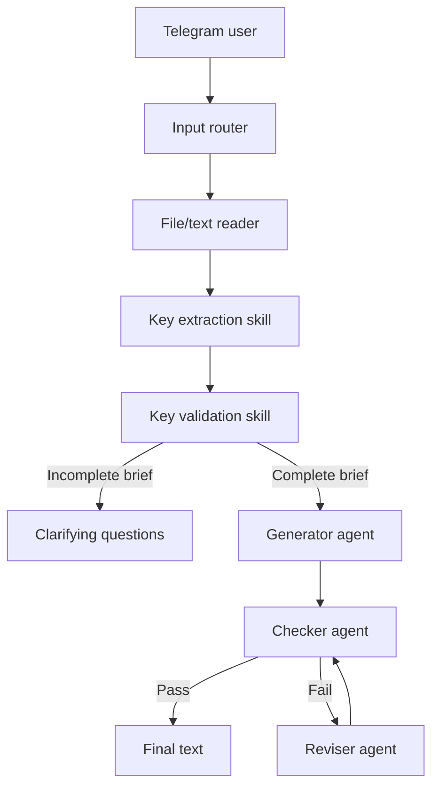

# Telegram AI Agent Text Generator

Telegram bot for turning structured text-generation briefs into reviewed drafts. It accepts plain messages or `TXT`, `MD`, `DOCX`, and `PDF` files, extracts generation keys, and runs a generator/checker/reviser workflow before sending the result back to the user.

## What It Does

| Capability | Description |
| --- | --- |
| Brief intake | Routes Telegram text messages and supported document uploads into a common processing flow. |
| Key extraction | Parses topic, language, word count, keywords, editorial policy, audience, tone, structure, and constraints into a typed schema. |
| Agent review loop | Generates a draft, checks it against the extracted keys, and revises failed drafts for a configurable number of cycles. |
| Clarification handling | Returns missing requirements and clarifying questions when the source brief is incomplete. |
| Long response support | Splits large bot replies into Telegram-friendly chunks. |

## Workflow



The workflow is deterministic around routing, file parsing, schema validation, and revision-cycle limits. Draft generation, checking, and revision are model-driven and should still be reviewed by a human before publication.

## Tech Stack

- Python 3.12+
- aiogram 3 for Telegram bot routing
- OpenAI Responses API for structured model output
- Pydantic and pydantic-settings for schemas and configuration
- python-docx and pypdf for document extraction
- pytest and pytest-asyncio for tests

## Setup

```bash
python -m venv .venv
source .venv/bin/activate
pip install -e ".[dev]"
cp .env.example .env
```

Fill `.env` with real credentials:

| Variable | Required | Default | Purpose |
| --- | --- | --- | --- |
| `TELEGRAM_BOT_TOKEN` | Yes | empty | Telegram bot token. |
| `OPENAI_API_KEY` | Yes | empty | API key for model calls. |
| `OPENAI_MODEL` | No | `gpt-4.1` | Model used by the agent workflow. |
| `BOT_RUN_MODE` | No | `polling` | `polling` for local/VPS runs or `webhook` for webhook hosting. |
| `WEBHOOK_URL` | For webhook mode | empty | Public webhook URL registered with Telegram. |
| `WEBHOOK_HOST` | No | `0.0.0.0` | Host interface for the webhook server. |
| `WEBHOOK_PORT` | No | `8080` | Webhook server port. |
| `MAX_REVISION_CYCLES` | No | `3` | Maximum checker/reviser loop count, from 1 to 10. |

## Run

For local development or a simple VPS process:

```bash
txt-key-generator-bot
```

For webhook hosting:

```bash
BOT_RUN_MODE=webhook WEBHOOK_URL=https://example.com/webhook txt-key-generator-bot
```

## Usage

Send the bot a message or supported file with generation keys:

```text
Тема: запуск продукта
Язык: русский
Объем: 500 слов
Ключевые слова: CRM, автоматизация, продажи
Редполитика: без канцелярита, короткие абзацы
Аудитория: руководители отделов продаж
```

The bot extracts the brief, generates a draft, validates it, and either returns the final text or asks for missing information.

## Development

Run the test suite:

```bash
pytest
```

The tests cover routing, file/system skills, checker behavior, and orchestration paths with fakes for model-backed components.

## Deployment Notes

- Use `BOT_RUN_MODE=polling` when the process can keep a long-lived Telegram polling connection.
- Use `BOT_RUN_MODE=webhook` when hosting behind a public HTTPS endpoint.
- Store `.env` values in the deployment platform's secret manager; do not commit real tokens.
- Add process supervision, logs, and health checks before running the bot as a persistent service.

## Limitations

- The repository does not currently include CI, release automation, or deployment manifests.
- There is no selected license yet.
- Model output quality depends on the completeness of the source brief and should be reviewed before external publication.
