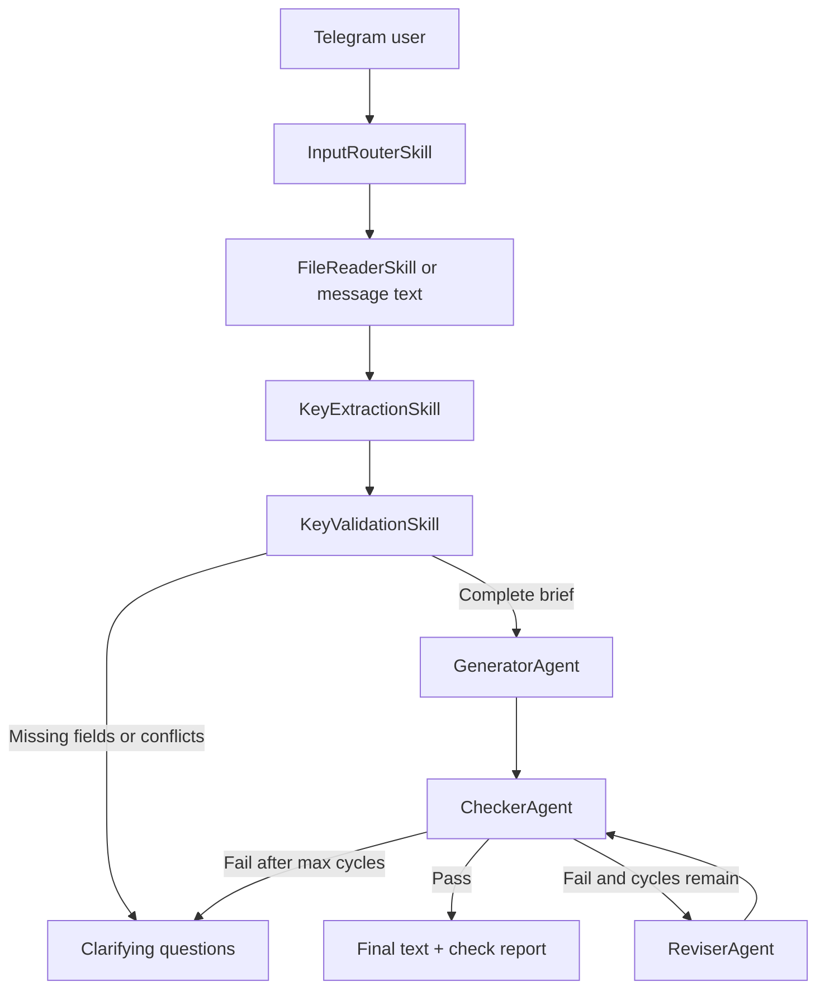

# Telegram AI Agent Text Generator

[](https://github.com/cbrt3ltrpv/MA_03-txt-key-generator/actions/workflows/ci.yml)

Telegram bot for turning structured text-generation briefs into reviewed drafts.
It accepts plain messages or `TXT`, `MD`, `DOCX`, and `PDF` files, extracts
generation keys, and runs a generator/checker/reviser workflow before sending
the result back to the user.

The project is built as a small agent workflow rather than a single prompt call:
deterministic skills handle routing, file parsing, schema validation, word-count
checks, keyword coverage, message splitting, and retry limits, while model-backed
agents handle extraction, drafting, semantic checking, and revision.

## Capabilities

| Capability | Description |
| --- | --- |
| Telegram brief intake | Routes text messages and supported document uploads into one processing flow. |
| Key extraction | Maps topic, language, word count, keywords, red policy, audience, tone, structure, constraints, and extra keys into a typed schema. |
| Custom parameters | Preserves user-defined keys such as `CTA`, `SEO title`, `Format`, `Platform`, or `Forbidden words` as generation and checking constraints. |
| Agent review loop | Generates a draft, checks it against the extracted keys, and revises failed drafts for a configurable number of cycles. |
| Clarification handling | Returns missing requirements and clarifying questions when the brief is incomplete or contradictory. |
| Document support | Reads `TXT`, `MD`, `DOCX`, and text-extractable `PDF` uploads from Telegram. |
| Long response support | Splits large bot replies into Telegram-friendly chunks. |

## Workflow



The workflow is deterministic around Telegram routing, file parsing,
required-field validation, conflict detection, word-count tolerance, keyword
coverage, message splitting, and revision-cycle limits. Draft generation, key
extraction, semantic checking, and text revision are model-driven through
structured OpenAI Responses API calls and should still be reviewed by a human
before publication.

## Agents

| Agent | Responsibility | Input | Output | Failure or review path |
| --- | --- | --- | --- | --- |
| `GeneratorAgent` | Builds the first draft from normalized generation keys. | `GenerationKeys` | `GeneratedDraft` | The draft is always sent to `CheckerAgent` before reaching the user. |
| `CheckerAgent` | Checks the draft against deterministic checks and model-evaluated requirements. | Draft text and `GenerationKeys` | `CheckReport` | Failed reports produce revision instructions or clarification questions. |
| `ReviserAgent` | Rewrites failed drafts according to the checker report while preserving satisfied constraints. | Draft text, `GenerationKeys`, `CheckReport` | `RevisionResult` | Revised text loops back to `CheckerAgent` until it passes or the cycle limit is reached. |

## Skills and Components

| Component | Role | Behavior | Workflow position |
| --- | --- | --- | --- |
| `InputRouterSkill` | Classifies Telegram commands, text, supported files, empty messages, and unsupported uploads. | Deterministic | Before orchestration |
| `FileReaderSkill` | Extracts plain text from `TXT`, `MD`, `DOCX`, and `PDF` payloads. | Deterministic | Before key extraction |
| `KeyExtractionSkill` | Parses free-form briefs into `GenerationKeys`. | Model-driven structured output | Start of orchestration |
| `KeyValidationSkill` | Requires topic, language, and target word count; detects include/avoid conflicts. | Deterministic | Before generation |
| `PromptBuildSkill` | Converts normalized keys into the generator prompt. | Deterministic | Generator input |
| `WordCountCheckSkill` | Checks target word count with tolerance. | Deterministic | Checker stage |
| `KeywordCoverageCheckSkill` | Reports missing keywords. | Deterministic | Checker stage |
| `ChecklistReportSkill` | Merges deterministic violations into the model-backed check report. | Deterministic | Checker stage |
| `TextRewriteSkill` | Builds a revision prompt from checker instructions and constraints. | Deterministic prompt builder | Reviser input |
| `MessageSplitterSkill` | Splits long Telegram responses into safe chunks. | Deterministic | Bot response |

## Example Interaction

Send the bot a message or supported file with generation keys. A reusable sample
is available in [`examples/brief.md`](examples/brief.md).

```text
Тема: запуск продукта
Язык: русский
Объем: 500 слов
Ключевые слова: CRM, автоматизация, продажи
Редполитика: без канцелярита, короткие абзацы
Аудитория: руководители отделов продаж
CTA: записаться на демо
```

Expected path:

1. The bot extracts `topic`, `language`, `target_word_count`, `keywords`,
   `red_policy`, `audience`, and custom `CTA`.
2. `KeyValidationSkill` confirms that the required fields are present and there
   are no include/avoid conflicts.
3. `GeneratorAgent` creates a draft.
4. `CheckerAgent` merges deterministic word-count and keyword checks with
   model-backed checks for language, structure, red policy, and custom
   parameters.
5. If the report passes, the bot returns the final text with a check report. If
   it fails, `ReviserAgent` rewrites the draft and the checker runs again until
   the configured cycle limit is reached.

If a brief is incomplete, for example only `Тема: CRM`, the bot asks for missing
parameters such as language and target word count instead of generating a draft
from guessed requirements.

## Tech Stack

| Area | Tools |
| --- | --- |
| Runtime | Python 3.12+ |
| Telegram | aiogram 3 |
| Model client | OpenAI Responses API with structured Pydantic output |
| Schemas and settings | Pydantic, pydantic-settings, python-dotenv |
| File parsing | python-docx, pypdf |
| Tests | pytest, pytest-asyncio |

## Project Structure

```text
src/txt_key_generator/
  agents/        Generator, checker, and reviser agents
  skills/        Deterministic and model-backed workflow skills
  app.py         Orchestrator factory
  bot.py         Telegram router, polling, and webhook entrypoint
  config.py      Environment-based settings
  orchestrator.py
  schemas.py     Pydantic contracts for inputs, reports, and results
tests/           Unit tests with fake model clients
examples/        Ready-to-send generation brief for manual workflow checks
.github/         Issue templates, pull request template, and CI workflow
```

## Setup

```bash
python -m venv .venv
source .venv/bin/activate
pip install -e ".[dev]"
cp .env.example .env
```

Fill `.env` with real credentials:

| Variable | Required | Default | Purpose |
| --- | --- | --- | --- |
| `TELEGRAM_BOT_TOKEN` | Yes | empty | Telegram bot token. |
| `OPENAI_API_KEY` | Yes | empty | API key for model calls. |
| `OPENAI_MODEL` | No | `gpt-4.1` | Model used by the agent workflow. |
| `BOT_RUN_MODE` | No | `polling` | `polling` for local/VPS runs or `webhook` for webhook hosting. |
| `WEBHOOK_URL` | For webhook mode | empty | Public webhook URL registered with Telegram. |
| `WEBHOOK_HOST` | No | `0.0.0.0` | Host interface for the webhook server. |
| `WEBHOOK_PORT` | No | `8080` | Webhook server port. |
| `MAX_REVISION_CYCLES` | No | `3` | Maximum checker/reviser loop count, from 1 to 10. |

## Run

For local development or a simple VPS process:

```bash
txt-key-generator-bot
```

For webhook hosting:

```bash
BOT_RUN_MODE=webhook WEBHOOK_URL=https://example.com/webhook txt-key-generator-bot
```

Webhook mode registers `/webhook` with Telegram and starts an `aiohttp` server
on `WEBHOOK_HOST:WEBHOOK_PORT`.

## Development

Run the test suite:

```bash
pytest
```

The tests cover routing, file/system skills, checker behavior, prompt
construction, custom parameter preservation, and orchestration paths with fake
model-backed components.

Useful local checks before opening a pull request:

```bash
python -m pytest
```

For contribution workflow, local checks, and pull request expectations, see
[`CONTRIBUTING.md`](CONTRIBUTING.md).

## Deployment Notes

- Use `BOT_RUN_MODE=polling` when the process can keep a long-lived Telegram polling connection.
- Use `BOT_RUN_MODE=webhook` when hosting behind a public HTTPS endpoint.
- Store `.env` values in the deployment platform's secret manager; do not commit real tokens.
- Add process supervision, logs, and health checks before running the bot as a persistent service.
- Keep a human review step for externally published content, especially when the
  checker asks for clarification or the final report score is low.

## Limitations

- There is no selected license yet.
- The repository does not include deployment manifests or release automation.
- PDF support depends on extractable text; image-only PDFs need OCR before this bot can read them.
- Model output quality depends on the completeness of the source brief, the
  selected model, and the clarity of the red policy and constraints.

## Roadmap

| Area | Next improvement |
| --- | --- |
| CI | Keep GitHub Actions running `pytest` on pull requests and pushes. |
| Demo assets | Capture a short Telegram text request and file-upload transcript to complement `examples/brief.md` in the README or social preview. |
| Deployment | Add a Dockerfile or process manager example for VPS/webhook hosting. |
| Evaluation | Add fixture-based regression checks for extraction, checker reports, and revision quality. |
| Observability | Add structured logs around extraction, cycle count, checker score, and failed file parsing. |
| Release readiness | Choose a license, define versioning, and add a changelog once releases start. |

## GitHub Collaboration

The repository includes issue templates for bug reports and feature requests, a
pull request template with checks for bot behavior, agent workflow, file
parsing, configuration/deployment impact, and test coverage, a contribution
guide, plus a GitHub Actions workflow that runs the Python test suite.
